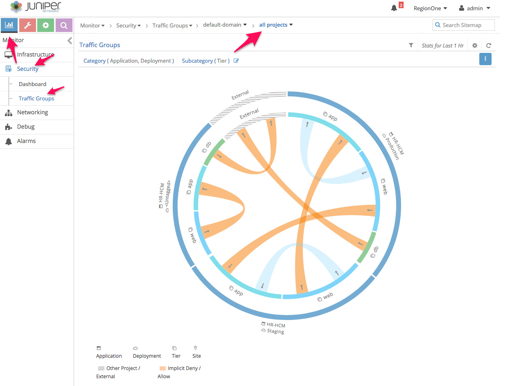

#  Gateway Less Forwarding Usecase Testbed (1vQFX and 4 VMs)


The main code of this repository is taken from [Juniper/vqfx10k-vagrant](https://github.com/Juniper/vqfx10k-vagrant) to create a Testbed for TSN testing.

* 1 vQFX 10K
* 4 VMs CentOS 7.5
  * 1 Provision VM
  * 1 Contrail Controller
  * 2 Compute Nodes

**Prerequisites**: A host machine with Ubuntu/CentOS OS preinstalled with Vagrant & VirtualBox SW.

For Vagrant and VirtualBox setup [vagrant-host-setup/README.md](https://gitlab.com/sohaibazed/contrail-gatewayless-forwarding/tree/master/vagrant-host-setup)

```bash
host> git@gitlab.com:sohaibazed/contrail-gatewayless-forwarding.git
host> contrail-gatewayless-forwarding
host> vagrant status
host> vagrantup
```

Download contrail-ansible-deployer.tar.gz file and place it inside the folder. By default without making any change in "Vagrantfile" above topology will be created. You can change MGMT and Ctrl+Data Subnet in Vagrantfile as needed.

```bash
$subnet_mgmt = "192.168.100"
$subnet_ctrl_data= "172.16.1"
```

### Install Contrail Command on Provision VM

```
yum install -y yum-utils device-mapper-persistent-data lvm2 
yum-config-manager --add-repo https://download.docker.com/linux/centos/docker-ce.repo
yum install -y docker-ce 
systemctl start docker
systemctl enable docker
docker login hub.juniper.net --username JNPR-FieldUser30 --password xRenAC86EKS5rBhv9UM4
docker pull hub.juniper.net/contrail/contrail-command-deployer:5.0.1-0.214
docker run -t --net host -v /root/command_servers.yml:/command_servers.yml -d --privileged --name contrail_command_deployer hub.juniper.net/contrail/contrail-command-deployer:5.0.1-0.214
docker logs -f contrail_command_deployer
```

### How to use Foxy Proxy for GUI access

Follow these steps for GUI access via FoxyProxy.
1- Open FireFox and open https://addons.mozilla.org/en-US/firefox/ URL.
2- Search for FoxyProxy and select "FoxyProxy Standard"
3- Click on "Add to Firefox"


Now open ssh port forwading session to physical server using port 1080. please change IP as per your host config

```bash
your-laptop> ssh root@<< physical server ip>> -D 1080
```

Configure FireFox FoxyProxy add-on by configuring "127.0.0.1" & port 1080 as Scoks4 as captured in screenshot.


Now enable FoxyProxy add-on by selecting the profile created earlier and open Contrail GUI using IP address of Vagrant VM https://192.168.100.11:8143


## Access Contrail and Openstack UIs

| Service   | URL                         | Username | Password    |
| --------- | --------------------------- | -------- | ----------- |
| openstack | http://192.168.100.11       | admin    | contrail123 |
| contrail  | https://192.168.100.11:8143 | admin    | contrail123 |


## Use Case 1: Contrail Security with Kubernetes, OpenStack and Bare Metal Server

### Prereq

Create "HR-Prod" and "HR-Stag" projects in openstack horizon UI

### Create Tags

1. Go to Configure> Tags> Global tags> +
2. Create the following tags
  * Application: HR-HCM
  * Deployment: Development, Production
  * Site: Duke, DeerValley
  * Tier= web, app, db, UnderlayServices


### Writing Policies

1. Create service group to allow tcp, udp and icmp traffic for each tier.


2. Go to Configure> Security> Global Policies> +
3. Create Application Policy Set (APS) and select application tag as "HR-HCM"


4. Associate firewall policy and the following rules
  * web > app
  * app > db
  * web <> AdminAccess
  * app <> AdminAccess


### Associate tags to contrail objects
For the policies to take effect, last step is to associate tags to contrail objects. These can be attached at the project, virtual network or virtual machine interface (VMI) level. The hierarchy is such that more granular takes precedence.

1. Go to Configure> Infrastructure> Project settings> tags (Select project HR-Dev)
2. Assign Application, Site and Deployment tags as shown below


3. Create virtual networks webvn, appvn and dbvn for each project (HR-Dev & HR-Prod) and assign appropriate tier tags. Assign same RT 63000:123 for all virtual networks to enable default allow all behavior. Assign appropriate tags to each VN. If you want to access underlayServices, select "IP Fabric Forwarding"


4. Attach UnderlayServices tag to bare metal server: Configure> Networking> Default-Project> Ports> * select vHost0

### Launch Workloads and generate Traffic

1. Inside HR-Stag and HR-Prod projects create web, app and db virtual machines with appropriate virtual networks.
2. Based on the rules added in previous step, try accessing different services hosted on vms from other vms.

### Validation of Traffic via Visualization

Visualization is perhaps the most important pillar of Contrail Security. This gives detailed view of all traffic (tagged or untagged) on the cluster and helps administrators identify compliant and non-compliant flows.

1. Got to Monitor> Security> Traffic Groups> * Select "all-project"



2. Single click on the traffic arc gives session type/port along with policy name


## Use Case 2: Gateway-less forwarding

### Add QFX switches as BGP routers in Contrail

1. Goto Configure > BGP routers > +
2. Add all four QFX switches
3. Under Address Families, add *inet*
4. Under Associate Peers, add all of the control nodes.


> make sure netconf and ssh is enabled on QFX switches before moving forward.

1. Goto Configure > Physical Devices > Physical Routers > +
2. Add all four QFX switches using netconf managed physical routers
3. Under Address Families, add *inet*
4. Under Associate Peers, add all of the control nodes.


5. after adding netconf based physical routers, you should see the following configurations in all qfx switches

```
{master:0}[edit]
juniperps@PSP6TORJ01# show groups __contrail__
routing-options {
    /* Global Routing Options */
    router-id 70.191.50.2;
    route-distinguisher-id 70.191.50.2;
    autonomous-system 64019;
    resolution {
        rib bgp.rtarget.0 {
            resolution-ribs inet.0;
        }
    }
}
protocols {
    /* Protocols Configuration */
    bgp {
        /* BGP Router: PSP6TORJ01, UUID: 6c9487af-959e-480f-85e7-46cb1c4b69cf */
        group _contrail_asn-64019 {
            type internal;
            local-address 70.191.50.2;
            hold-time 90;
            family evpn {
                signaling;
            }
            family route-target;
            /* BGP Router: PSP6TORJ04, UUID: e5cdb4ac-a09e-42fa-8aa5-85914b75eb2e */
            neighbor 70.191.50.67 {
                peer-as 64019;
            }
            /* BGP Router: PSP6TORJ03, UUID: 998995d0-c5fb-4e8d-be66-83639d7658ee */
            neighbor 70.191.50.66 {
                peer-as 64019;
            }
            /* BGP Router: psp6neosctr01, UUID: 0486974e-8fdf-4121-be7d-c089d3f59567 */
            neighbor 70.191.50.6 {
                peer-as 64019;
            }
            /* BGP Router: psp6neosctr02, UUID: 05d4f638-7f32-4f40-9a0e-00746848f72f */
            neighbor 70.191.50.7 {
                peer-as 64019;
            }
            /* BGP Router: psp6neosctr03, UUID: c17077c7-9d26-4e44-9bda-ee498a5bfcbc */
            neighbor 70.191.50.8 {
                peer-as 64019;
            }
        }
    }
}
policy-options {
    /* Policy Options */
    community _contrail_switch_policy_ members target:64019:1;
}
switch-options {
    vtep-source-interface lo0.0;
}
```
6. add the following lines of configuration to each QFX switch manually

```
{master:0}[edit]
juniperps@PSP6TORJ01# set groups __contrail__ protocols bgp group _contrail_asn-64019 family inet unicast

{master:0}[edit]
juniperps@PSP6TORJ01# commit and-quit
[edit protocols]
configuration check succeeds
commit complete
Exiting configuration mode
```
### Create IPAM and Virtual networks
1. Goto Configure > IP Address Management > +


2. Goto Configure > networks > +
3. Under subnets > Allocation mode, select flat and under subnets > Flat subnet IPAM, select gatewayless-ipam created in last step
3. Under Advance Options > Admin state, check "IP Fabric forwarding"


### Create Network Policy to route Traffic
1. Goto Configure > Policies > +


2. Assign this policy to gatewayless-vn and ip-fabric ( default-project )

### Launch Workloads and generate Traffic

1. Inside HR-Prod projects create gateway-less-vm1 and gatewayless-vm2 virtual machines using gatewayless-vn virtual network.
2. Try accessing vm2 from vm1
3. Log into any QFX switch and run the following command. you should see the IP address of VMs and vrouter IPs as next-hop.

```
juniperps@PSP6TORJ03> show route receive-protocol bgp 70.191.50.6 active-path

inet.0: 114 destinations, 117 routes (114 active, 0 holddown, 0 hidden)
Prefix		                Nexthop	             MED     Lclpref    AS path
* 10.30.63.3/32           70.191.50.68         100     200        ?
* 10.30.63.4/32           70.191.50.68         100     200        ?
```
4. Running tcpdump on tap interfaces will show you that traffic is not encapsulated.


### References

* <https://github.com/Juniper/contrail-ansible-deployer/wiki>
* <https://github.com/Juniper/vqfx10k-vagrant>
