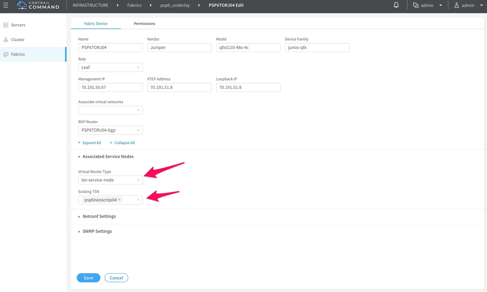

#  Gateway Less Forwarding Usecase Testbed (1vQFX and 4 VMs)


The main code of this repository is taken from [Juniper/vqfx10k-vagrant](https://github.com/Juniper/vqfx10k-vagrant) to create a Testbed for TSN testing.

* 1 vQFX 10K
* 4 VMs CentOS 7.5
  * 1 Contrail Command VM
  * 1 Contrail Controller
  * 2 Compute Nodes
  * 1 BareMetal VM

**Prerequisites**: A host machine with Ubuntu/CentOS OS preinstalled with Vagrant & VirtualBox SW.

For Vagrant and VirtualBox setup [vagrant-host-setup/README.md](https://gitlab.com/sohaibazed/contrail-gatewayless-forwarding/tree/master/vagrant-host-setup)

```bash
host> git@gitlab.com:sohaibazed/contrail-gatewayless-forwarding.git
host> contrail-gatewayless-forwarding
host> vagrant status
host> vagrantup
```

Download contrail-ansible-deployer.tar.gz file and place it inside the folder. By default without making any change in "Vagrantfile" above topology will be created. You can change MGMT and Ctrl+Data Subnet in Vagrantfile as needed.

```bash
$subnet_mgmt = "192.168.100"
$subnet_ctrl_data= "172.16.1"
```

### Install Contrail Command on Provision VM

```bash
yum install -y yum-utils device-mapper-persistent-data lvm2
yum-config-manager --add-repo https://download.docker.com/linux/centos/docker-ce.repo
yum install -y docker-ce
systemctl start docker
systemctl enable docker
docker login hub.juniper.net --username JNPR-FieldUser30 --password xRenAC86EKS5rBhv9UM4
docker pull hub.juniper.net/contrail/contrail-command-deployer:5.0.1-0.214
docker run -t --net host -v /root/command_servers.yml:/command_servers.yml -d --privileged --name contrail_command_deployer hub.juniper.net/contrail/contrail-command-deployer:5.0.1-0.214
docker logs -f contrail_command_deployer
```

Sample command_servers.yml file used to install contrail command

```yaml
---
command_servers:
    server1:
        ip: 192.168.100.15
        connection: ssh
        ssh_user: root
        ssh_pass: c0ntrail123
        sudo_pass: c0ntrail123
        ntpserver: 66.129.255.62

        # Specify either container_path
        #container_path: /root/contrail-command-051618.tar
        # or registry details and container_name
        # registry_insecure: true
        # container_registry: ci-repo.englab.juniper.net:5010
        container_registry: hub.juniper.net/contrail
        container_name: contrail-command
        #container_tag: 5.0-214
        container_tag: 5.0.1-0.214
        #container_registry_username: username@juniper.net
        #container_registry_password: passwordforregistry
        config_dir: /etc/contrail

        # contrail command container configurations given here go to /etc/contrail/contrail.yml
        contrail_config:
            # Database configuration. MySQL/PostgreSQL supported
            database:
                # MySQL example
                type: mysql
                dialect: mysql
                host: localhost
                user: root
                password: contrail123
                name: contrail_test
                # Postgres example
                #connection: "user=root dbname=contrail_test sslmode=disable"
                #type: postgres
                #dialect: postgres

                # Max Open Connections for DB Server
                max_open_conn: 100
                connection_retries: 10
                retry_period: 3s

            # Log Level
            log_level: debug

            # Server configuration
            server:
              enabled: true
              read_timeout: 10
              write_timeout: 5
              log_api: true
              address: ":9091"

              # TLS Configuration
              tls:
                  enabled: true
                  key_file: /usr/share/contrail/ssl/cs-key.pem
                  cert_file: /usr/share/contrail/ssl/cs-cert.pem

              # Enable GRPC or not
              enable_grpc: false

              # Static file config
              # key: URL path
              # value: file path. (absolute path recommended in production)
              static_files:
                  /: /usr/share/contrail/public

              # API Proxy configuration
              # key: URL path
              # value: String list of backend host
              #proxy:
              #    /contrail:
              #    - http://localhost:8082

              notify_etcd: false

            # Keystone configuration
            keystone:
                local: true
                assignment:
                    type: static
                    data:
                      domains:
                        default: &default
                          id: default
                          name: default
                      projects:
                        admin: &admin
                          id: admin
                          name: admin
                          domain: *default
                        demo: &demo
                          id: demo
                          name: demo
                          domain: *default
                      users:
                        admin:
                          id: admin
                          name: Admin
                          domain: *default
                          password: contrail123
                          email: admin@juniper.nets
                          roles:
                          - id: admin
                            name: Admin
                            project: *admin
                        bob:
                          id: bob
                          name: Bob
                          domain: *default
                          password: bob_password
                          email: bob@juniper.net
                          roles:
                          - id: Member
                            name: Member
                            project: *demo
                store:
                    type: memory
                    expire: 3600
                insecure: true
                authurl: https://localhost:9091/keystone/v3

            # disable authentication with no_auth true and comment out keystone configuraion.
            #no_auth: true
            insecure: true

            etcd:
              endpoints:
                - localhost:2379
              username: ""
              password: ""
              path: contrail

            watcher:
              enabled: false
              storage: json

            client:
              id: admin
              password: contrail123
              project_id: admin
              domain_id: default
              schema_root: /
              endpoint: https://localhost:9091

            compilation:
              enabled: false
              # Global configuration
              plugin_directory: 'etc/plugins/'
              number_of_workers: 4
              max_job_queue_len: 5
              msg_queue_lock_time: 30
              msg_index_string: 'MsgIndex'
              read_lock_string: "MsgReadLock"
              master_election: true

              # Plugin configuration
              plugin:
                  handlers:
                      create_handler: 'HandleCreate'
                      update_handler: 'HandleUpdate'
                      delete_handler: 'HandleDelete'

            agent:
              enabled: true
              backend: file
              watcher: polling
              log_level: debug

         # The following are optional parameters used to patch/cherrypick
         # revisions into the contrail-ansible-deployer sandbox. These configs
         # go into the /etc/contrail/contrail-cluster.tmpl file
#        cluster_config:
#            ansible_fetch_url: "https://review.opencontrail.org/Juniper/contrail-ansible-deployer refs/changes/80/40780/20"
#            ansible_cherry_pick_revision: FETCH_HEAD
#            ansible_revision: GIT_COMMIT_HASH
```


### How to use Foxy Proxy for GUI access

Follow these steps for GUI access via FoxyProxy.
1- Open FireFox and open https://addons.mozilla.org/en-US/firefox/ URL.
2- Search for FoxyProxy and select "FoxyProxy Standard"
3- Click on "Add to Firefox"


Now open ssh port forwading session to physical server using port 1080. please change IP as per your host config

```bash
your-laptop> ssh root@<< physical server ip>> -D 1080
```

Configure FireFox FoxyProxy add-on by configuring "127.0.0.1" & port 1080 as Scoks4 as captured in screenshot.


Now enable FoxyProxy add-on by selecting the profile created earlier and open Contrail GUI using IP address of Vagrant Contrail Command VM https://192.168.100.15:9091


## Access Contrail Command UIs

| Service   | URL                         | Username | Password    |
| --------- | --------------------------- | -------- | ----------- |
| Contrail Command | https://192.168.100.15:9091       | admin    | contrail123 |

## Install Contrail cluster using Contrail Command UI.


## Access Contrail UIs


| Service   | URL                         | Username | Password    |
| --------- | --------------------------- | -------- | ----------- |
| Contrail Command | https://192.168.100.15:9091       | admin    | contrail123 |
| Contrail UI | https://192.168.100.11:8143 | admin | contrail123 |
| Openstack | http://192.168.100.11 | admin | contrail123 |

## Compute Node QEMU (hypervisor/emulator) change if your Host does not support KVM HW virtualization (Nested mode)

Note: You usually need that for VmWare or AWS setup which does not support HW virtualization. Your VM instance creation will fail and you have to make following changes in "nova-compute" before creating the workload.


```bash
vagrant ssh srv2
vi /etc/kolla/nova-compute/nova.conf

# Add last two line under [libvirt] section 
[libvirt]
connection_uri = qemu+tcp://192.168.2.12/system
virt_type=qemu
cpu_mode=none

# After making changes restart "nova_compute" conatiner on the compute
docker restart nova_compute
```

## Use Case 1: Contrail Security with Kubernetes, OpenStack and Bare Metal Server

### Prereq

Create "HR-Prod" and "HR-Stag" projects in openstack horizon UI

### Create Tags

1. Go to Configure> Tags> Global tags> +
2. Create the following tags
  * Application: HR-HCM
  * Deployment: Development, Production
  * Site: Duke, DeerValley
  * Tier= web, app, db, UnderlayServices


### Writing Policies

1. Create service group to allow tcp, udp and icmp traffic for each tier.


2. Go to Configure> Security> Global Policies> +
3. Create Application Policy Set (APS) and select application tag as "HR-HCM"


4. Associate firewall policy and the following rules
  * web > app
  * app > db
  * web <> AdminAccess
  * app <> AdminAccess


### Associate tags to contrail objects
For the policies to take effect, last step is to associate tags to contrail objects. These can be attached at the project, virtual network or virtual machine interface (VMI) level. The hierarchy is such that more granular takes precedence.

1. Go to Configure> Infrastructure> Project settings> tags (Select project HR-Dev)
2. Assign Application, Site and Deployment tags as shown below


3. Create virtual networks webvn, appvn and dbvn for each project (HR-Dev & HR-Prod) and assign appropriate tier tags. Assign same RT 63000:123 for all virtual networks to enable default allow all behavior. Assign appropriate tags to each VN. If you want to access underlayServices, select "IP Fabric Forwarding"


4. Attach UnderlayServices tag to bare metal server: Configure> Networking> Default-Project> Ports> * select vHost0

### Launch Workloads and generate Traffic

1. Inside HR-Stag and HR-Prod projects create web, app and db virtual machines with appropriate virtual networks.
2. Based on the rules added in previous step, try accessing different services hosted on vms from other vms.

### Validation of Traffic via Visualization

Visualization is perhaps the most important pillar of Contrail Security. This gives detailed view of all traffic (tagged or untagged) on the cluster and helps administrators identify compliant and non-compliant flows.

1. Got to Monitor> Security> Traffic Groups> * Select "all-project"


2. Single click on the traffic arc gives session type/port along with policy name


## Use Case 2: Baremetal Integration using QFX switches

### Add QFX switches as BGP routers in Contrail

1. Log into contrail command UI
2. Select fabric from the menu on left side and click "create" button

3. Select existing fabric and click "provision"

4. Type in the IP address and credentials for the QFX switches and click next

5. Contrail Command will scan the CIDR and discover QFX switches.
6. Assign roles to discovered devices.

7. After the process is complete, edit the QFX switch and assign TSN node to the switches

8. Select cluster from the menu on the left side and select advance options and then BGP routers
9. Edit all routers and contrail controllers and add inet.0 under address families.

QFX switches are successfully added. you can ssh into the switch and run the following command to ensure it has an active bgp session with contrail controller nodes

```
master:0}
juniperps@PSP6TORJ04> show bgp summary
70.191.50.69          64019         11         11       0       0        3:55 Establ
  bgp.rtarget.0: 3/3/3/0
  bgp.evpn.0: 0/0/0/0
  default-switch.evpn.0: 0/0/0/0
  __default_evpn__.evpn.0: 0/0/0/0
```

The following command will list configuration pushed from contrail fabric Manager
```
juniperps@PSP6TORJ04> show configuration groups | display set |match __*
```

Sample configuration pushed to QFX leaf switch 

```
juniperps@PSP6TORJ04> show configuration groups | display set | match __*
set groups __contrail_basic__ snmp community public authorization read-only
set groups __contrail_ip_clos__ routing-options router-id 70.191.51.8
set groups __contrail_ip_clos__ routing-options route-distinguisher-id 70.191.51.8
set groups __contrail_ip_clos__ routing-options autonomous-system 64019
set groups __contrail_ip_clos__ routing-options forwarding-table export PFE-LB
set groups __contrail_ip_clos__ routing-options forwarding-table ecmp-fast-reroute
set groups __contrail_ip_clos__ policy-options policy-statement PFE-LB then load-balance per-packet
set groups __contrail_ip_clos__ policy-options policy-statement IPCLOS_BGP_EXP term loopback from protocol direct
set groups __contrail_ip_clos__ policy-options policy-statement IPCLOS_BGP_EXP term loopback from interface lo0.0
set groups __contrail_ip_clos__ policy-options policy-statement IPCLOS_BGP_EXP term loopback then accept
set groups __contrail_ip_clos__ policy-options policy-statement IPCLOS_BGP_EXP term default then reject
set groups __contrail_ip_clos__ policy-options policy-statement IPCLOS_BGP_IMP term loopback from protocol bgp
set groups __contrail_ip_clos__ policy-options policy-statement IPCLOS_BGP_IMP term loopback from protocol direct
set groups __contrail_ip_clos__ policy-options policy-statement IPCLOS_BGP_IMP term loopback then accept
set groups __contrail_ip_clos__ policy-options policy-statement IPCLOS_BGP_IMP term default then reject
set groups __contrail_overlay_bgp__ routing-options resolution rib bgp.rtarget.0 resolution-ribs inet.0
set groups __contrail_overlay_bgp__ protocols bgp group _contrail_asn-64019 type internal
set groups __contrail_overlay_bgp__ protocols bgp group _contrail_asn-64019 local-address 70.191.51.8
set groups __contrail_overlay_bgp__ protocols bgp group _contrail_asn-64019 hold-time 90
set groups __contrail_overlay_bgp__ protocols bgp group _contrail_asn-64019 family evpn signaling
set groups __contrail_overlay_bgp__ protocols bgp group _contrail_asn-64019 family route-target
set groups __contrail_overlay_bgp__ protocols bgp group _contrail_asn-64019 export _contrail_ibgp_export_policy
set groups __contrail_overlay_bgp__ protocols bgp group _contrail_asn-64019 multipath
set groups __contrail_overlay_bgp__ protocols bgp group _contrail_asn-64019 neighbor 70.191.50.69 peer-as 64019
set groups __contrail_overlay_bgp__ policy-options policy-statement _contrail_ibgp_export_policy term inet-vpn then next-hop self
set groups __contrail_overlay_bgp__ policy-options policy-statement _contrail_ibgp_export_policy term inet6-vpn then next-hop self
set groups __contrail_overlay_bgp__ policy-options policy-statement _contrail_ibgp_export_policy term inet then next-hop self
set groups __contrail_overlay_evpn__ interfaces xe-0/0/33 flexible-vlan-tagging
set groups __contrail_overlay_evpn__ interfaces xe-0/0/33 native-vlan-id 4094
set groups __contrail_overlay_evpn__ interfaces xe-0/0/33 encapsulation extended-vlan-bridge
set groups __contrail_overlay_evpn__ interfaces xe-0/0/33 unit 0 vlan-id 4094
set groups __contrail_overlay_evpn__ protocols evpn vni-options vni 9 vrf-target target:64019:8000003
set groups __contrail_overlay_evpn__ protocols evpn encapsulation vxlan
set groups __contrail_overlay_evpn__ protocols evpn multicast-mode ingress-replication
set groups __contrail_overlay_evpn__ protocols evpn extended-vni-list all
set groups __contrail_overlay_evpn__ policy-options policy-statement _contrail_bn1-l2-9-import term t1 from community target_64019_8000003
set groups __contrail_overlay_evpn__ policy-options policy-statement _contrail_bn1-l2-9-import term t1 then accept
set groups __contrail_overlay_evpn__ policy-options policy-statement _contrail_bn1-l2-9-export term t1 then accept
set groups __contrail_overlay_evpn__ policy-options community target_64019_8000003 members target:64019:8000003
set groups __contrail_overlay_evpn__ switch-options vtep-source-interface lo0.0
set groups __contrail_overlay_evpn__ switch-options route-distinguisher 70.191.51.8:1
set groups __contrail_overlay_evpn__ switch-options vrf-import _contrail_bn1-l2-9-import
set groups __contrail_overlay_evpn__ switch-options vrf-export _contrail_bn1-l2-9-export
set groups __contrail_overlay_evpn__ switch-options vrf-target target:64019:1
set groups __contrail_overlay_evpn__ switch-options vrf-target auto
set groups __contrail_overlay_evpn__ vlans contrail_bn1-l2-9 vlan-id 4094
set groups __contrail_overlay_evpn__ vlans contrail_bn1-l2-9 interface xe-0/0/33.0
set groups __contrail_overlay_evpn__ vlans contrail_bn1-l2-9 vxlan vni 9
set groups __contrail_overlay_lag__
set groups __contrail_overlay_multi_homing__
set groups __contrail_overlay_security_group__
```
### Add Bare metal server and attach it to a virtual networks

1. Select Serves from the menu on left side and click "add" button
2. type in the details of the bare metal servers

3. Goto Infrastructure > Instances. Create a new instances


4. Log in the baremetal server and run the following command. Bare metal server will send DHCP request. The request will be routed to TSN node.

```
[root@psp6neoscmp05 ~]# pkill dhclient
[root@psp6neoscmp05 ~]# dhclient p3p2
[root@psp6neoscmp05 ~]# ifconfig p3p2
p3p2: flags=4163<UP,BROADCAST,RUNNING,MULTICAST>  mtu 1500
        inet 20.20.20.3  netmask 255.255.255.0  broadcast 20.20.20.255
        ether a0:36:9f:bf:48:4a  txqueuelen 1000  (Ethernet)
        RX packets 18393  bytes 6334689 (6.0 MiB)
        RX errors 0  dropped 0  overruns 0  frame 0
        TX packets 17556  bytes 1292304 (1.2 MiB)
        TX errors 0  dropped 0 overruns 0  carrier 0  collisions 0
```

5. Bare metal server is assigned IP address from virtual network "bn1"
6. Create a virtual machine on the same virtual network and test connectivity.

## Use Case 3: Gateway-less forwarding

### Add QFX switches as BGP routers in Contrail
QFX switches are added as part of use case 2.

### Create IPAM and Virtual networks
1. Goto Configure > IP Address Management > +


2. Goto Configure > networks > +
3. Under subnets > Allocation mode, select flat and under subnets > Flat subnet IPAM, select gatewayless-ipam created in last step
3. Under Advance Options > Admin state, check "IP Fabric forwarding"


### Create Network Policy to route Traffic
1. Goto Configure > Policies > +


2. Assign this policy to gatewayless-vn and ip-fabric ( default-project )

### Launch Workloads and generate Traffic

1. Inside HR-Prod projects create gateway-less-vm1 and gatewayless-vm2 virtual machines using gatewayless-vn virtual network.
2. Try accessing vm2 from vm1
3. Log into any QFX switch and run the following command. you should see the IP address of VMs and vrouter IPs as next-hop.

```
juniperps@PSP6TORJ03> show route receive-protocol bgp 70.191.50.6 active-path

inet.0: 114 destinations, 117 routes (114 active, 0 holddown, 0 hidden)
Prefix		                Nexthop	             MED     Lclpref    AS path
* 10.30.63.3/32           70.191.50.68         100     200        ?
* 10.30.63.4/32           70.191.50.68         100     200        ?
```
4. Running tcpdump on tap interfaces will show you that traffic is not encapsulated.


### References

* <https://github.com/Juniper/contrail-ansible-deployer/wiki>
* <https://github.com/Juniper/vqfx10k-vagrant>
